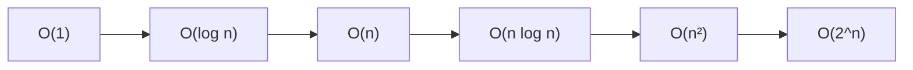

# Buổi 01: Giới thiệu DSA & Độ phức tạp

## Mục tiêu

- Hiểu DSA là gì và vì sao quan trọng.
- Biết cách đánh giá độ phức tạp thời gian/không gian.

## Khái niệm chính

- **Time Complexity**: số bước tính toán theo kích thước input $n$.
- **Space Complexity**: bộ nhớ phụ trợ theo $n$.
- **Big-O**: cận trên, dùng để mô tả tăng trưởng.

## Minh họa tăng trưởng

## Bảng độ phức tạp phổ biến

| Tên | Ví dụ | Nhận xét |
|---|---|---|
| $O(1)$ | Truy cập mảng theo index | Rất nhanh |
| $O(log n)$ | Binary Search | Tăng chậm |
| $O(n)$ | Duyệt mảng | Tuyến tính |
| $O(n^2)$ | Hai vòng lặp | Chậm khi $n$ lớn |

## Ghi nhớ

- Ưu tiên thuật toán có Big-O nhỏ.
- Độ phức tạp không nói về tốc độ tuyệt đối, mà nói về **tốc độ tăng trưởng**.
