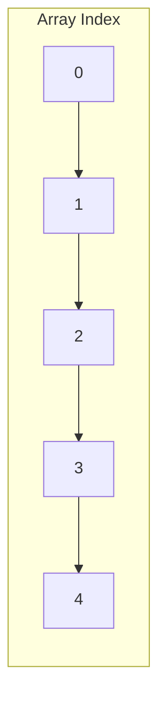

# Buổi 02: Mảng & Mảng động

## Mục tiêu

- Hiểu cách lưu trữ liên tiếp trong bộ nhớ.
- Nắm thao tác truy cập, chèn, xóa.

## Khái niệm chính

- Mảng tĩnh: kích thước cố định.
- Mảng động: thay đổi kích thước (vector/list).

## Minh họa

## Ghi nhớ

- Truy cập theo index: $O(1)$.
- Chèn/xóa ở giữa: $O(n)$ do phải dời phần tử.
