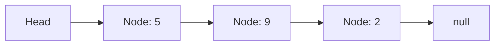

# Buổi 03: Linked List

## Mục tiêu

- Hiểu cấu trúc node và con trỏ.
- Thao tác chèn/xóa ở đầu/cuối.

## Khái niệm chính

- Node: chứa dữ liệu + con trỏ next.
- Head: node đầu tiên.

## Minh họa

## Ghi nhớ

- Chèn/xóa đầu: $O(1)$.
- Tìm kiếm: $O(n)$.
