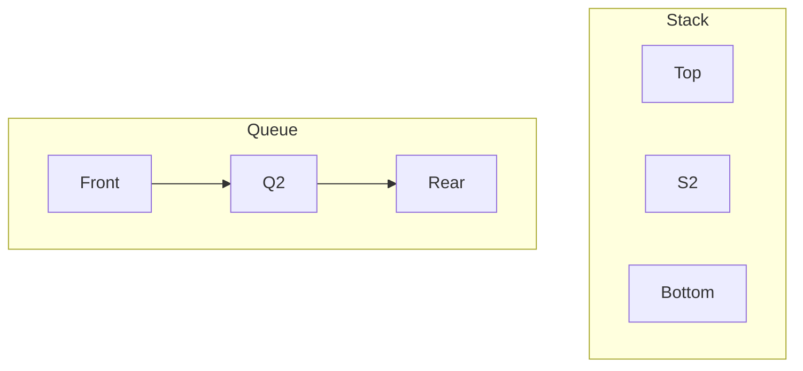

# Buổi 04: Stack & Queue

## Mục tiêu

- Hiểu LIFO/FIFO và ứng dụng.

## Khái niệm chính

- Stack: push/pop/top.
- Queue: enqueue/dequeue/front.

## Minh họa

## Ghi nhớ

- Stack dùng cho undo, backtracking.
- Queue dùng cho BFS, xử lý theo thứ tự.
