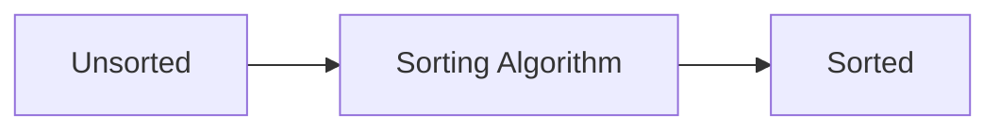

# Buổi 06: Sorting

## Mục tiêu

- Hiểu các thuật toán sắp xếp cơ bản.
- Biết khi nào chọn thuật toán phù hợp.

## Minh họa

## So sánh nhanh

| Thuật toán | Tốt nhất | Trung bình | Tệ nhất |
|---|---|---|---|
| Bubble | $O(n)$ | $O(n^2)$ | $O(n^2)$ |
| Merge | $O(n log n)$ | $O(n log n)$ | $O(n log n)$ |
| Quick | $O(n log n)$ | $O(n log n)$ | $O(n^2)$ |
