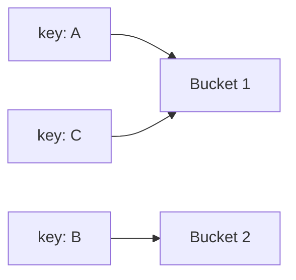

# Buổi 07: Searching & Hash

## Mục tiêu

- Biết tìm kiếm tuyến tính và nhị phân.
- Hiểu Hash Table và collision.

## Minh họa Hash Table

## Ghi nhớ

- Binary Search chỉ áp dụng cho dữ liệu đã sắp xếp.
- Hash Table trung bình $O(1)$, tệ nhất $O(n)$.
