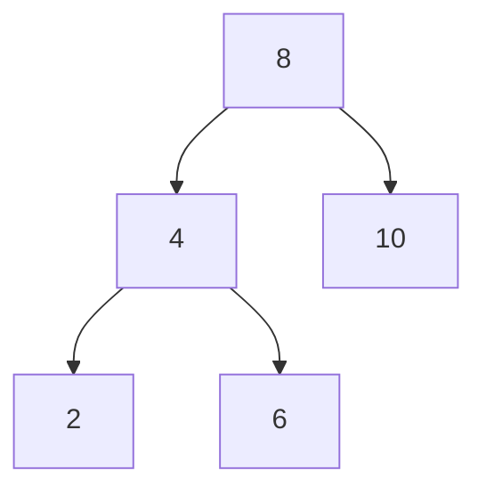

# Buổi 08: Cây (Tree) cơ bản

## Mục tiêu

- Hiểu node, root, leaf, height.
- Nắm cách duyệt Pre/In/Post-order.

## Minh họa

## Ghi nhớ

- Tree là cấu trúc phân cấp.
- Duyệt DFS có 3 kiểu: pre/in/post.
