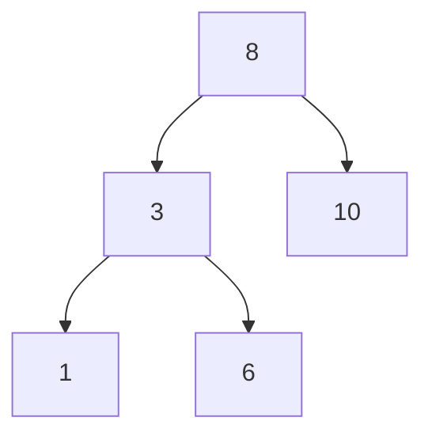

# Buổi 09: BST & AVL

## Mục tiêu

- Hiểu BST và tính chất thứ tự.
- Nắm khái niệm cân bằng (AVL).

## Minh họa BST

```mermaid
flowchart TB
  A[8] --> B[3]
  A --> C[10]
  B --> D[1]
  B --> E[6]
```

## Ghi nhớ

- BST: left < root < right.
- AVL: chênh lệch chiều cao tối đa 1.
