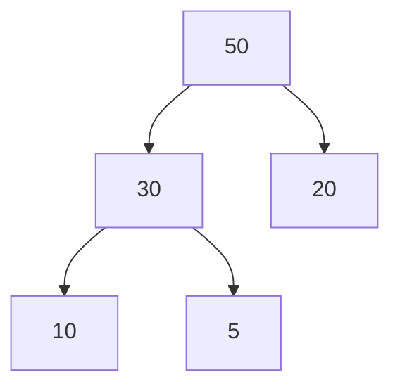

# Buổi 10: Heap & Priority Queue

## Mục tiêu

- Hiểu max-heap/min-heap.
- Ứng dụng trong lấy phần tử ưu tiên.

## Minh họa

```mermaid
flowchart TB
  A[50] --> B[30]
  A --> C[20]
  B --> D[10]
  B --> E[5]
```

## Ghi nhớ

- Heap là binary tree hoàn chỉnh.
- Push/Pop: $O(log n)$.
