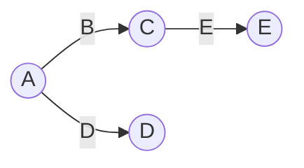

# Buổi 11: Graph

## Mục tiêu

- Biết biểu diễn đồ thị.
- Áp dụng BFS/DFS.

## Minh họa

```mermaid
flowchart LR
  A((A)) -- B --> C((C))
  A -- D --> D((D))
  C -- E --> E((E))
```

## Ghi nhớ

- Adjacency list tiết kiệm bộ nhớ cho đồ thị thưa.
- BFS dùng queue, DFS dùng stack/đệ quy.
