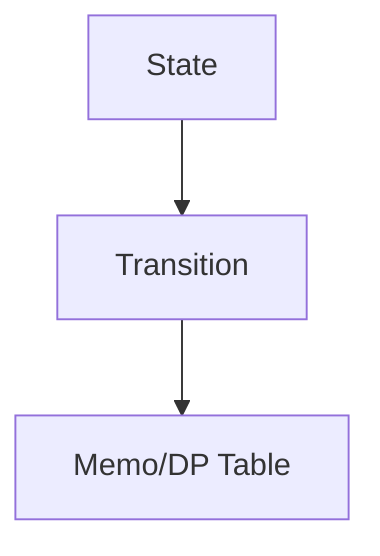

# Buổi 12: DP & String

## Mục tiêu

- Hiểu tư duy quy hoạch động.
- Nắm thuật toán chuỗi cơ bản.

## Minh họa DP

## Ghi nhớ

- Xác định state, transition, base case.
- String: tìm mẫu, so khớp, prefix.
